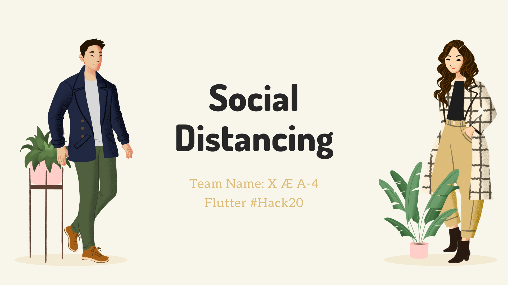
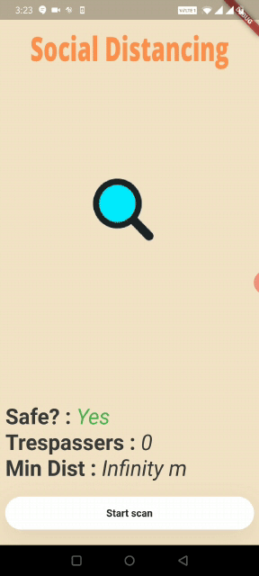

# Healthy While Distant

This is a simple application for social distancing using Bluetooth low energy(BLE).
It also comprises of a yoga app to relieve mental stress.

Our motivation for this app was the current Covid-19 pandemic going on in the world affecting the health and mental health of people. As y'll know social distancing is beneficial during this time hence this is an app that can alert its user with haptic feedback if any other individual comes within "1.8m" ~ "6ft" of the user. This distance is calculated using BLE sensor of user device and other's emitter. Accurate distance is calculated using the RSSI technology, with standard RSSI being "-69".

## Application
### Social Distancing: -

### Yoga: -

## Getting started
### Prequisites
1) Flutter
2) Dart sdk
3) Android studio(preferably) 

### Running Steps
1) Clone/ download the repo
2) Open the project with android studio
3) Run pub get on pubspec.yaml file i.e. `flutter pub get`
4) Click Run

## Youtube Link: -
https://youtu.be/uJne7uuiEUM

## Team members: -
Jay Jhaveri: https://github.com/JayJhaveri1906

Abhay Gupta: https://github.com/abhay8463

Prem Chhabria: https://github.com/premchhabria

Sahil Lotya: https://github.com/sahillotya

Mohit Govekar: https://github.com/govekarmohit

